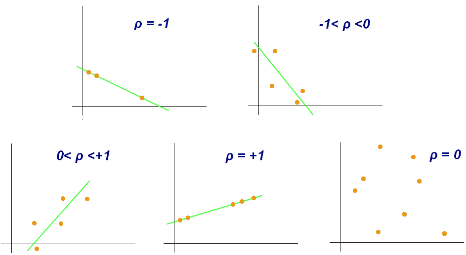

# Programming and Scripting Project - the Iris data set 

| Topic | Details |
|---------|-------------|
| **Module:**  | Programming and Scripting  |
| **Lecturer:**  | Andrew Beatty  | 
| **Course:**  | Diploma in Science in Computing (Data Analytics)  |
| **Year/Semester:**  | Year 1/Semester 1  |
| **Student Name:**  | David O'Connell  |
| **Student ID:**  | G00438912  |
| **Student Email:**  | G00438912@atu.ie  |

## Purpose of this Repository  
This repository contains the files associated with the Programming and Scripting final project, the subject of which is an analysis of Fisher's iris data set.  
Link to repository - [PANDS Project](https://github.com/dvdgeroconnell/pands-project.git).  

## Project Summary
### Problem Statement
This is summarized from the detailed Project Description in [g2].
The project is about researching and analyzing the well-known Fisher’s Iris data set [g1]. The investigation requires documentation and code (in Python [c6]) to be written. The project will need to be broken into several smaller tasks that are easier to solve, and these will need to be plugged together once they have been completed. Steps to follow:

1. Research the data set online and write a summary about it in your README.
2. Download the data set and add it to your repository.
3. Write a program called analysis.py that:
    1 .Outputs a summary of each variable to a single text file,
    2. Saves a histogram of each variable to png files, and
    3. Outputs a scatter plot of each pair of variables.
    4. Performs any other analysis you think is appropriate.

The requiremnent for original text and analysis was emphasized in the Project Description.

### Approach
While it was left open as to whether to create a Jupyter notebook as well as the README, it was decided to capture the reasearch and analysis in the README to avoid repetition and / or referencing over and back between documents.

# Background Research  

## Fisher's Iris data set
The Iris flower data set was originally gathered by botanist [Edgar Anderson](https://en.wikipedia.org/wiki/Edgar_Anderson) as part of his work to develop techniques to quantify geographic variation the morphological differences and geographical variations between different species of Iris - Iris setosa, Iris versicolor and Iris virginica.  

**Figure 1 - Iris Species**  
   
Source [g8]  

The data set contains 150 sets of measurements, consisting of a set of 50 measurements for each of the 3 species of Iris flowers across 4 attributes, those being petal length, petal width, sepal length and sepal width, measured in centimeters. The measurements cover the sepal and petal length and width for each flower in cm. These are shown in Figure 2 below.  

**Figure 2 - Iris Characteristics**  
  
Source [g4]

The dataset is often called "Fisher's Iris data set" as it was presented as an example of linear discriminant analysis in a 1936 paper, *"The use of multiple measurements in taxonomic problems"* by the British statistician and biologist [Ronald A. Fisher](https://en.wikipedia.org/wiki/Ronald_Fisher). [Linear discriminant analysis](https://en.wikipedia.org/wiki/Linear_discriminant_analysis) is a method used in statistics, and other fields, to find a linear combination of features that characterizes or separates two or more classes of objects or events. Fisher used the Iris data set to demonstrate how his linear discriminant model could be used to distinguish the 3 species from each other based on the 4 known attributes [g1]. The paper is available [here](https://digital.library.adelaide.edu.au/dspace/handle/2440/15227).  
This data set is widely used in field of statistical data analysis and pattern recognition / machine learning [g1], [g3]. One class is linearly separable from the other 2; the latter are not linearly separable from each other [g7].  

# Using the Program
## Libraries and Packages Used
| Software | Version | Summary|
|---------|-------------|---------|
|[Python](https://www.python.org/) | 3.11.7 | Python is a programming language that lets you work more quickly and integrate your systems more effectively.  |
|[NumPy](https://numpy.org/) |1.26.4 | NumPy is an open source project that enables numerical computing with Python.  
|[Pandas](https://pandas.pydata.org/) |2.1.4 | Pandas is a software library written for the Python programming language for data manipulation and analysis.  |
|[Matplotlib](https://matplotlib.org/) | 3.8.0 | Matplotlib is a comprehensive library for creating static, animated, and interactive visualizations in Python. |  
|[Seaborn](https://seaborn.pydata.org/) | 0.13.2 | Seaborn is a Python data visualization library based on matplotlib. |  
|[VS Code](https://code.visualstudio.com/) | 1.88.0 | Visual Studio Code is a lightweight but powerful source code editor which runs on your desktop. |  

## Files in this Repository  
### iris.csv
The raw dataset in useable csv format was downloaded from [here](https://raw.githubusercontent.com/mwaskom/seaborn-data/master/iris.csv). This csv file has already undergone some cleanup, including the addition of a heaading row and presentation of the different species as simply *setosa*, *versicolor* and *virginica*.  
### analysis.py  
This file contains the main Python program to offer the menu options and run the relevant functions based on the menu option chosen.   
Execute the program by typing *"python analysis.py"*. This results in the menu being presented. 
### menu.py  
This file contains a Python function to draw the menu of options, check the entered choice is a valid integer and return the value to the calling program, where the range checking is done.     
### write_summary.py  
This file contains a Python function to calculate the following statistics for the Iris dataset overall and by species, specifically:  
- Minimum value  
- Maximum value  
- Median value  
- Mean value  
- Standard Deviation  

The values are written to a text file. The name is displayed to the user.  
### hist_all.py  
This file contains a Python function to draw the histograms for the iris dataset variables by species. There are 12 in total, 4 per species.  
- Petal Length  
- Petal Width  
- Sepal Length  
- Sepal Width  

The histograms are drawn as a single figure, which is then saved to a file. The name is displayed to the user.  
### petal.py  
This file contains 2 Python functions to create histograms of a) the petal length and b) the petal width by species. They are then written to files. The name are displayed to the user.  
### sepal.py  
This file contains 2 Python functions to create histograms of a) the petal length and b) the petal width by species. They are then written to files. The names are displayed to the user.  
### scatter_all.py  
This file contains a Python function to draw the pairwise scatter plots for the Iris dataset variables, colour-coded by species. The scatter plots are drawn as a single figure using both Matplotlib and Seaborn for comparison. They are written to files and the names are displayed to the user.    
### write_correlation.py  
This file contains a Python function to calculate the correlation coefficients and draw the heatmaps for the Iris dataset, both overall and by species. The heatmaps are drawn as a single figure and saved to a file. The name is displayed to the user. 
### bestfit_all.py  
A Python function to draw the pairwise scatter plots for the Iris dataset variables colour-coded by species. Best fit lines are then calculated using NumPy's ployfit method and superimposed on the scatter plots. The plots are drawn as a single figure. Seaborn is then used to create similar scatter plots with best fit lines by species for comparison. Both versions are saved to files and the names are displayed to the user.

# Analysis

## Menu Options

The user is presented with the following menu:

    Enter one of the following:
    1 for a statistical summary of the iris dataset to be written to a file
    2 for a set of histograms representing the iris dataset variables written to a file
    3 for histograms and density plots representing the individual iris variables written to 4 files
    4 for a set of scatter plots representing the iris dataset variables
    5 for the correlation and heatmaps of the iris dataset variables across the species
    6 for the best fit line
    0 to quit
    Enter choice:

## Option 1 - Statistical Summary
what does it tell us?  

## Option 2 - Histograms
what does it tell us?

## Correlation
The Pandas *corr()* method [c4] is used to establish a pairwise correlation between columns.  
NaN, NULL values are excluded.
The method of correlation may be chosen from Pearson, Kendall-Tau and Spearman. Pearson is the default, and was used in this analysis [c5].  

The Pearson correlation coefficient is defined as "the ratio between the covariance of two variables and the product of their standard deviations. It is essentially a normalized measurement of the covariance, such that the result always has a value between −1 and 1" [g5].Covariance is defined as a measure of the joint variability of two random variables [g6], or in other words, how closely change in one is related to change in another.

If both increase together, the covariance will be positive. If one decreases as the other increases, the covariance will be negative, denoting an inverse relationship. This can be seen in Figure 3.  

**Figure 3 - Scatter diagrams with various values of ρ, the correlation coefficient**  
  
Source [g5]

offers a choice of correlation
Method of correlation:

Compute pairwise correlation of columns, excluding NA/null values

## How to use this Repository

Note to self - review this - https://docs.github.com/en/repositories/managing-your-repositorys-settings-and-features/customizing-your-repository/about-readmes

# References  
## Methodology
Since markdown doesn't support superscripts, the paragraph, quotation or figure are followed by the applicable reference or citation in square brackets. The references are listed below, and are prefixed with 'g' or 'c' depending on whether they're in the list of general or code references. So, for example, [g7] refers to item 7 in the General Reference list below.

## General References (prefixed with g)  
1. [iris dataset wikipedia page](https://en.wikipedia.org/wiki/Iris_flower_data_set)  
2. [Project Description](PANDS_Project_2024.pdf)
3. [About Fisher's Iris dataset](https://www.angela1c.com/projects/iris_project/the-iris-dataset/)  
4. [Exploring the Iris flower dataset](https://eminebozkus.medium.com/exploring-the-iris-flower-dataset-4e000bcc266c)  
5. [Pearson Correlation Coefficient](https://en.wikipedia.org/wiki/Pearson_correlation_coefficient)
6. [Covariance](https://en.wikipedia.org/wiki/Covariance)
7. [UCI Irvine Machine Learning Repository](https://archive.ics.uci.edu/dataset/53/iris)
8. [The Iris Dataset - A Little Bit of History and Biology](https://towardsdatascience.com/the-iris-dataset-a-little-bit-of-history-and-biology-fb4812f5a7b5)

## Code References (prefixed with c)  
1. [matplotlib subplots page](https://matplotlib.org/stable/gallery/subplots_axes_and_figures/subplots_demo.html)  
2. [match/case statement syntax](https://www.datacamp.com/tutorial/python-switch-case)  
3. [Pandas tutorials](https://pandas.pydata.org/docs/getting_started/intro_tutorials/index.html)  
4. [Pandas correlation method](https://www.geeksforgeeks.org/python-pandas-dataframe-corr/)  
5. [Pandas documentation on corr()](https://pandas.pydata.org/docs/reference/api/pandas.DataFrame.corr.html)  
6. [Python Software Foundation](https://www.python.org/)

****
#### End