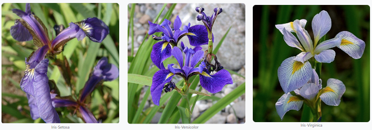

# Programming and Scripting Project - the Iris data set 

| Topic | Details |
|---------|-------------|
| **Module:**  | Programming and Scripting  |
| **Lecturer:**  | Andrew Beatty  | 
| **Course:**  | Diploma in Science in Computing (Data Analytics)  |
| **Year/Semester:**  | Year 1/Semester 1  |
| **Student Name:**  | David O'Connell  |
| **Student ID:**  | G00438912  |
| **Student Email:**  | G00438912@atu.ie  |

## Purpose of this Repository  
This repository contains the files associated with the Programming and Scripting final project, the subject of which is an analysis of Fisher's iris data set.  
Link to repository - [PANDS Project](https://github.com/dvdgeroconnell/pands-project.git).  

## Project Summary
### Problem Statement
This is summarized from the detailed Project Description in [g2].
The project is about researching and analyzing the well-known Fisher’s Iris data set [7]. The investigation requires documentation and code (in Python [c6]) to be written. The project will need to be broken into several smaller tasks that are easier to solve, and these will need to be plugged together once they have been completed. Steps to follow:

1. Research the data set online and write a summary about it in your README.
2. Download the data set and add it to your repository.
3. Write a program called analysis.py that:
    1 .Outputs a summary of each variable to a single text file,
    2. Saves a histogram of each variable to png files, and
    3. Outputs a scatter plot of each pair of variables.
    4. Performs any other analysis you think is appropriate.

The requiremnent for original text and analysis was emphasized in the Project Description.

### Approach
While it was left open to us as to whether to create a Jupyter notebook as well as the README, I have decided to capture the reasearch and analysis in the README to avoid repetition and / or referencing over and back between documents.

containing all your comment. This notebook should only contain text that you have written yourself, (it may contain referenced code from other sources). I will harshly mark any text (not code) that I feel is not written directly by you. I want to know what YOU think, not some third party. Please make sure the style of your documentation is consistent.

## Background - Fisher's iris data set

The Iris flower data set was originally created by botanist Edgar Anderson in 1935 in order to analyse the morphological differences between different species of Iris. It consists of 50 sets of data from each of three species (Iris setosa, Iris versicolor and Iris virginica) across 4 characteristics - petal length, petal width, sepal length and sepal width. This data set widely used in field of statistical data analysis and pattern recognition / machine learning [g1], [g3].  

**Figure 1 - Iris Species**  
   
Source [g3]  

The dataset is often called "Fisher's Iris data set" as it became the subject of a 1936 paper, *"The use of multiple measurements in taxonomic problems"* by the British statistician and biologist Ronald Fisher.    
The dataset contains 150 sets of measurements, consisting of a set of 50 measurements for each of 3 species of iris flowers - setosa, versicolor and virginica. The measurements cover the sepal and petal length and width for each flower in cm. These are shown in Figure 2 below. Fisher developed a model, based on the relationships between these 4 characteristics, to uniquely identify each species [g1].  

**Figure 2 - Iris Characteristics**  
  
Source [g4]

## Files in this Repository  

#### analysis.py  
This is the main Python program to offer the menu options and run the relevant functions based on the menu option chosen.   
Execute the program by typing *"python analysis.py"*. This results in the menu being presented. 
#### menu.py  
This is a Python function to draw the menu of options, check the entered choice is a valid integer and return the value to the calling program, where the range checking is done.     
#### write_summary.py  
xxx  
#### hist_all.py  
xxx  
#### petal.py  
xxx  
#### sepal.py  
xxx    
#### scatter_all.py  
xxx  
#### write_correlation.py  
xxx  
#### bestfit_all.py  
xxx  

# Analysis
## Correlation
The Pandas *corr()* method [c4] is used to establish a pairwise correlation between columns.  
NaN, NULL values are excluded.
The method of correlation may be chosen from Pearson, Kendall-Tau and Spearman. Pearson is the default, and was used in this analysis [c5].  

The Pearson correlation coefficient is defined as "the ratio between the covariance of two variables and the product of their standard deviations. It is essentially a normalized measurement of the covariance, such that the result always has a value between −1 and 1" [g5].Covariance is defined as a measure of the joint variability of two random variables [g6], or in other words, how closely change in one is related to change in another.

If both increase together, the covariance will be positive. If one decreases as the other increases, the covariance will be negative, denoting an inverse relationship. This can be seen in Figure 3.  

**Figure 3 - Scatter diagrams with various values of ρ, the correlation coefficient**  
  
Source [g5]

offers a choice of correlation
Method of correlation:

Compute pairwise correlation of columns, excluding NA/null values

## How to use this Repository

CC BY-SA 3.0, https://commons.wikimedia.org/w/index.php?curid=170298 - setosa
CC BY-SA 3.0, https://commons.wikimedia.org/w/index.php?curid=248095 - versicolor
By Frank Mayfield - originally posted to Flickr as Iris virginica shrevei BLUE FLAG, CC BY-SA 2.0, https://commons.wikimedia.org/w/index.php?curid=9805580

This summary was derived from various sources, notably [1], [2]
More information may be found in reference 4.

## Source
The raw dataset in useable csv format was downloaded from [here](https://raw.githubusercontent.com/mwaskom/seaborn-data/master/iris.csv). The raw csv file has already undergone some cleanup, including the varieties being presented simply as setosa, versicolor and virginica.

Note to self - review this - https://docs.github.com/en/repositories/managing-your-repositorys-settings-and-features/customizing-your-repository/about-readmes

# References  
## General References (prefixed with g)  
1. [iris dataset wikipedia page](https://en.wikipedia.org/wiki/Iris_flower_data_set)  
2. [Project Description](PANDS_Project_2024.pdf)
3. [About Fisher's Iris dataset](https://www.angela1c.com/projects/iris_project/the-iris-dataset/)  
4. [Exploring the Iris flower dataset](https://eminebozkus.medium.com/exploring-the-iris-flower-dataset-4e000bcc266c)  
5. [Pearson Correlation Coefficient](https://en.wikipedia.org/wiki/Pearson_correlation_coefficient)
6. [Covariance](https://en.wikipedia.org/wiki/Covariance)
7. [UCI Irvine Machine Learning Repository](https://archive.ics.uci.edu/dataset/53/iris)

## Code References (prefixed with c)  
1. [matplotlib subplots page](https://matplotlib.org/stable/gallery/subplots_axes_and_figures/subplots_demo.html)  
2. [match/case statement syntax](https://www.datacamp.com/tutorial/python-switch-case)  
3. [Pandas tutorials](https://pandas.pydata.org/docs/getting_started/intro_tutorials/index.html)  
4. [Pandas correlation method](https://www.geeksforgeeks.org/python-pandas-dataframe-corr/)  
5. [Pandas documentation on corr()](https://pandas.pydata.org/docs/reference/api/pandas.DataFrame.corr.html)  
6. [Python Software Foundation](https://www.python.org/)

****
#### End