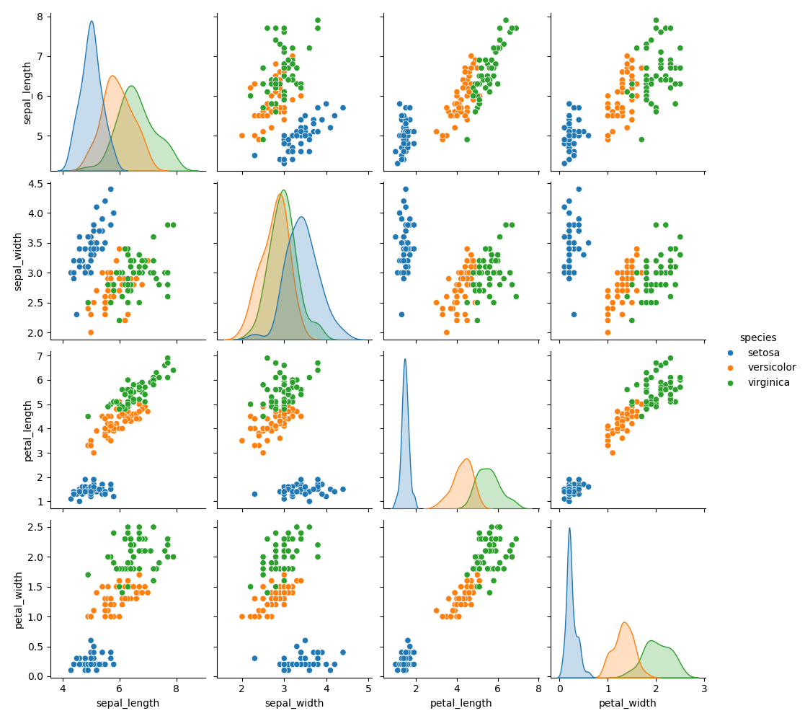
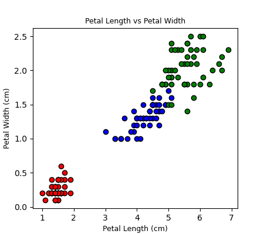

# Programming and Scripting Project
## An Analysis of Fisher's Iris Data Set using Python  
  
| Topic | Details |
|---------|-------------|
| **Module:**  | 8632 - Programming and Scripting  |
| **Lecturer:**  | Andrew Beatty  | 
| **Course:**  | Diploma in Science in Computing (Data Analytics)  |
| **Year/Semester:**  | Year 1/Semester 1  |
| **Student Name:**  | David O'Connell  |
| **Student ID:**  | G00438912  |
| **Student Email:**  | G00438912@atu.ie  |  
   
    
# Summary Table of Contents
[Purpose of this Repository](#Purpose-of-this-Repository)  
[Project Summary](#Project-Summary)  
[Background - Fisher's Iris Data Set](#Background---Fisher's-Iris-Data-Set)  
[Using the Program](#Using-the-Program)  
[Analysis](#Analysis)  
[Conclusions](#Conclusions)  
[References](#References)  

# Purpose of this Repository  

This repository contains the files associated with the Programming and Scripting final project, the subject of which is an analysis of Fisher's iris data set.  
  
Link to repository - [PANDS Project](https://github.com/dvdgeroconnell/pands-project.git).  
  
### A Caveat on Links  
Links to other points within the document are used throughout. They do not work consistently when viewed in Visual Studio Code. The links do work when viewed in GitHub Markdown, however sometimes the link takes you to the section just below the anchor.  
  

# Project Summary

## Problem Statement  
The following is summarized from the detailed Project Description in [g2].  
The project is about researching and analyzing the well-known Fisher’s Iris data set [g1]. The investigation requires documentation and code (in Python [c6]) to be written. The project will need to be broken into several smaller tasks that are easier to solve, and these will need to be plugged together once they have been completed. Steps to follow:  
  
1. Research the data set online and write a summary about it in the README.
2. Download the data set and add it to the repository.
3. Write a program called analysis.py that:
    1. Outputs a summary of each variable to a single text file
    2. Saves a histogram of each variable to png files, and
    3. Outputs a scatter plot of each pair of variables
    4. Performs any other analysis you think is appropriate
  
The requirement for original text and analysis is emphasized in the Project Description.  

## Approach
While it was left open as to whether to create a Jupyter notebook as well as the README, I decided to capture the research and analysis in the README to avoid repetition and / or cross-referencing between multiple documents.  
  
The primary Python packages used were the NumPy, Matplotlib Pandas and Seaborn packages. For the scatter plots and best fit lines, I used both Numpy / Matplotlib and Seaborn as a comparison.  

# Background - Fisher's Iris Data Set  

The Iris flower data set was originally gathered by botanist [Edgar Anderson](https://en.wikipedia.org/wiki/Edgar_Anderson) as part of his work to develop techniques to quantify geographic variation the morphological differences and geographical variations between different species of Iris - *Iris setosa*, *Iris versicolor* and *Iris virginica*.  

**Figure 1 - Iris Species**  
   
Source [g8]  

The data set contains 150 sets of measurements, consisting of a set of 50 measurements for each of the 3 species of Iris flowers across 4 attributes, those being petal length, petal width, sepal length and sepal width, measured in centimeters. The attributes and how they apply to the flower itself are shown in Figure 2.  

**Figure 2 - Iris Characteristics**  
  
Source [g4]

The data set is often called "Fisher's Iris data set" as it was presented as an example of linear discriminant analysis in a 1936 paper, *"The use of multiple measurements in taxonomic problems"* by the British statistician and biologist [Ronald A. Fisher](https://en.wikipedia.org/wiki/Ronald_Fisher). [Linear discriminant analysis](https://en.wikipedia.org/wiki/Linear_discriminant_analysis) is a method used in statistics and other fields to find a linear combination of features that characterizes or separates two or more classes of objects or events. Fisher used the Iris data set to demonstrate how his linear discriminant model could be used to distinguish the 3 species from each other based on the 4 measured attributes [g1].  
The paper is available [here](https://digital.library.adelaide.edu.au/dspace/handle/2440/15227).  
  
This data set is widely used in field of statistical data analysis and pattern recognition / machine learning.  
It is often used to understand classification and clustering algorithms.   
  
This data set is particularly popular due to its simplicity and the clear separation of the different species based on the measured attributes. Using those measured attributes, researchers and data scientists can classify each sample into one of the three species. One species (*setosa*) is linearly separable from the other 2; the other 2 species, *versicolor* and *virginica*, are not linearly separable from each other [g1], [g7].  

# Using the Program  
  

## Libraries and Packages Used
| Software | Version | Summary|
|---------|-------------|---------|
|[Python](https://www.python.org/) | 3.11.7 | Python is a programming language that lets you work more quickly and integrate your systems more effectively.  |
|[NumPy](https://numpy.org/) |1.26.4 | NumPy is an open source project that enables numerical computing with Python.  
|[Pandas](https://pandas.pydata.org/) |2.1.4 | Pandas is a software library written for the Python programming language for data manipulation and analysis.  |
|[Matplotlib](https://matplotlib.org/) | 3.8.0 | Matplotlib is a comprehensive library for creating static, animated, and interactive visualizations in Python. |  
|[Seaborn](https://seaborn.pydata.org/) | 0.13.2 | Seaborn is a Python data visualization library based on matplotlib. |  
|[VS Code](https://code.visualstudio.com/) | 1.88.0 | Visual Studio Code is a lightweight but powerful source code editor which runs on your desktop. |  

## Files in this Repository  
### iris.csv
The raw data set in csv format was downloaded from [here](https://raw.githubusercontent.com/mwaskom/seaborn-data/master/iris.csv). This csv file has already undergone some cleanup and error correction, including the addition of a heading row and presentation of the different species as simply *setosa*, *versicolor* and *virginica*.  
### analysis.py  
This file contains the main Python program to offer the menu options and run the relevant functions based on the chosen menu option.   
### menu.py  
This file contains a Python function to draw the menu of options, check the entered choice is a valid integer and return the value to the calling program, where the range checking is done.     
### write_summary.py  
This file contains a Python function to calculate the following statistics for the Iris data set overall and by species, specifically:  
- Minimum value  
- Maximum value  
- Median value  
- Mean value  
- Standard Deviation  

The values are written to a text file. The name of the file is displayed to the user.  
### hist_all.py  
This file contains a Python function to draw the histograms for the Iris data set variables by species. There are 12 histograms in total, 4 per species, covering:  
- Petal Length  
- Petal Width  
- Sepal Length  
- Sepal Width  

The histograms are drawn as a single figure, which is then saved to a file. The name is displayed to the user.  
### petal.py  
This file contains 2 Python functions to create histograms of a) the petal length and b) the petal width by species. They are then written to files. The name are displayed to the user.  
### sepal.py  
This file contains 2 Python functions to create histograms of a) the sepal length and b) the sepal width by species. They are then written to files. The names are displayed to the user.  
### scatter_all.py  
This file contains a Python function to draw the pairwise scatter plots for the Iris data set variables, colour-coded by species. The scatter plots are drawn as a single figure using both Matplotlib and Seaborn for comparison. They are written to files and the names of the files are displayed to the user.    
### write_correlation.py  
This file contains a Python function to calculate the correlation coefficients and draw the heatmaps for the Iris data set, both overall and by species. The heatmaps are drawn as a single figure and saved to a file. The name of the file is displayed to the user. 
### bestfit_all.py  
A Python function to draw the pairwise scatter plots for the Iris data set variables colour-coded by species. Best fit lines are then calculated using NumPy's ployfit method [c7] and superimposed on the scatter plots. The plots are drawn as a single figure. Seaborn is then used to create similar scatter plots with best fit lines by species for comparison. Both versions are saved to files and the names are displayed to the user.

## Running the Program
Clone the GitHub repository using the link in the [Purpose of this Repository](#Purpose-of-this-Repository) section.  
Execute the program by typing *"python analysis.py"*. This results in the menu being presented.  
The menu options and their outputs are described in the [Program Outputs](#Program-Outputs) section.  

# Analysis  
  

## Correlation  

The Pandas *corr()* method [c4] is used to establish a pairwise correlation between columns. NaN, NULL values are excluded.  
  
The method of correlation may be one of Pearson, Kendall-Tau and Spearman. Pearson is the default, and was used in this analysis [c5]. The Pearson correlation coefficient is defined as "the ratio between the covariance of two variables and the product of their standard deviations" [g5], where covariance in probability theory and statistics is a measure of the joint variability of two random variables, X and Y, and is defined as "the expected value (or mean) of the product of the deviations of X and Y from their individual expected values" [g6] - or, in other words, how closely change in one is related to change in the other.  

Pearson's correlation coefficient is essentially a normalized measurement of the covariance, such that the result always has a value between −1 and 1 [g5]. If both increase together, the covariance will be positive. If one decreases as the other increases, the covariance will be negative, denoting an inverse relationship. This can be seen in the examples in Figure 3a and 3b.

**Figures 3a and 3b - Scatter diagrams with various values of ρ, the correlation coefficient**  

       
Source [g5]  
  
The lower the correlation value in absolute terms, the weaker the relationship between the x and y variables. For example, a correlation of 0.8 or -0.8 implies a strong relationship between the x and y variable; whereas a correlation of 0.2 or -0.2 implies a weak relationship.  
Note that the Pearson correlation coefficient is symmetric: corr(X,Y) = corr(Y,X) [g5].  

## Best Fit  

A best fit or regression line is intended to represent a set of points such that the sum of the squared distance from each point to the line is minimized. This is called the Ordinary Least Squares (OLS) method.  
    
The distance (usually the vertical distance) from each point to the line is called the residual, and it may be positive or negative depending on whether the point is above of below the line. The simplest case is linear regression, where the solution is a straight line or first order polynomial:  
  
$y = mx + c$;  
  
$m$ is the called the *slope* and $c$ is called the *intercept*.  
  
**Figure 4 - Linear Regression line with Residuals**  
  
Source [g10]

The advantage of linear regression is that it establishes a trend and allows you to make educated guesses about further values. It also allows you to identify outliers - for example, if a data point is way off the best fit line, it may merit further inspection.  
  
A disadvantage of linear regression model is that it is very unlikely to be a perfect fit to real world data, and you lose visibility to variances within the data set - this is where the correlation coefficient is useful, as it indicates how well your data is likely to be modelled by a straight line. A higher order polynomial regression model may be a better fit, however it involves increased complexity and is less intuitive [g3].  
  
**Figure 5 - Best Fit / Line**  
  
Source [g10]  

In this program, the NumPy ployfit method is used. This method supports both linear and polynomial regression:  

*best_fit = numpy.polyfit(x, y, order)*

where order = 1 for linear regression. The Ordinary Least Squares method is used to calculate the best fit [c7], [g3].

## Program Outputs

The user is presented with the following menu:

    Enter one of the following:
    1 for a statistical summary of the iris data set to be written to a file
    2 for a set of histograms representing the iris data set variables written to a file
    3 for histograms and density plots representing the individual iris variables written to 4 files
    4 for a set of scatter plots representing the iris data set variables
    5 for the correlation and heatmaps of the iris data set variables across the species
    6 for the best fit line
    0 to quit
    Enter choice:

### Option 1 - Statistical Summary  

When this option is chosen, the following summary data is written to *iris_summary.txt*.  
  
    Overall summary for the iris data set
            petal_length  petal_width  sepal_length  sepal_width
    min         1.000000     0.100000      4.300000     2.000000
    max         6.900000     2.500000      7.900000     4.400000
    median      4.350000     1.300000      5.800000     3.000000
    mean        3.758000     1.199333      5.843333     3.057333
    std         1.765298     0.762238      0.828066     0.435866

    Statistical summary for the setosa species
            petal_length  petal_width  sepal_length  sepal_width
    min         1.000000     0.100000       4.30000     2.300000
    max         1.900000     0.600000       5.80000     4.400000
    median      1.500000     0.200000       5.00000     3.400000
    mean        1.462000     0.246000       5.00600     3.428000
    std         0.173664     0.105386       0.35249     0.379064

    Statistical summary for the versicolor species
            petal_length  petal_width  sepal_length  sepal_width
    min         3.000000     1.000000      4.900000     2.000000
    max         5.100000     1.800000      7.000000     3.400000
    median      4.350000     1.300000      5.900000     2.800000
    mean        4.260000     1.326000      5.936000     2.770000
    std         0.469911     0.197753      0.516171     0.313798

    Statistical summary for the virginica species
            petal_length  petal_width  sepal_length  sepal_width
    min         4.500000      1.40000       4.90000     2.200000
    max         6.900000      2.50000       7.90000     3.800000
    median      5.550000      2.00000       6.50000     3.000000
    mean        5.552000      2.02600       6.58800     2.974000
    std         0.551895      0.27465       0.63588     0.322497

#### Observations  

The mean values for *Iris setosa* petal length and petal width, at 1.462cm and 0.246cm, are much smaller than for *Iris versicolor*, at 4.26cm and 1.326cm, and *Iris virginica* at 5.552cm and 2.026cm. This detail is lost by taking the mean values across the full Iris data set, so we should look at the data for the individual species for the rest of this exercise.   
  
In fact, there is clear separation between *Iris setosa* and the other 2 species as the maximum petal length for *Iris setosa* is 1.9cm, which is below the minimum petal length of 3.0cm for *Iris versicolor* and 4.5cm for *Iris virginica*. Similarly for petal width, the maximum for *Iris setosa* is 0.6cm, which is below the minimum of 1.0cm for *Iris versicolor* and of 1.4cm for *Iris virginica*.  The relatively small standard deviations for *Iris setosa* petal length and petal width would also indicate a smaller spread.  
    
 There is no such clear separation between *Iris versicolor* and *Iris virginica* petal lengths and petal widths. While the petal length means are different, at 4.26cm and 5.552cm respectively, the maximum petal length for *Iris versicolor*, the smaller of the two, overlaps the minimum petal length for *Iris viginica*. Similarly for petal width, the maximum for *Iris versicolor*, the smaller of the two, overlaps the minimum for *Iris virginica*.  
  
The sepal lengths and sepal widths paint a much less clear picture, as all 3 of the species overlap. Therefore, these attributes could not be used to tell the species apart. This will become clearer when we look at the histograms and scatter plots.  
  
In summary the statistics indicate that we should consider the data for each species individually, as too much detail is lost by averaging across the iris data set as a whole.  

### Option 2 - Histograms  

Choosing this option causes a set of 12 histograms to be drawn, representing the 4 attributes (petal length, petal width, sepal length, sepal width) for each of the 3 species. Matplotlib's *plt.subplots()* is used to create the figure and axes. The *Axes.hist()* method is used to draw the individual subplots. The output is saved to *hist_all.png*.
  
**Figure 6 - Iris attribute histograms by species**  
  

#### Observations  
Each column represents an attribute, with the name for that attribute at the top of the column.    
Each row represents a species, which are also colour coded and labelled.  
Looking at the petal length and petal width columns, the separation of the *Iris setosa* from the other 2 species can be clearly seen, as previously pointed out. The overlaps between *Iris versicolor* and *Iris virginica* can also be seen, making it more difficult to discriminate between these species on the basis of those attributes.  
Also as previously observed, the sepal length and sepal width attributes clearly overlap for all 3 species. Those attributes cannot be used to definitively distinguish between species.  
  
 ### Option 3 - Individual Histograms  
The following histograms each represent a single attribute as a row, with a plot per species. Density plots are included and show the spread for each attribute. The output is saved to 4 files:
- *hist_petal_length.png*  
- *hist_petal_width.png*  
- *hist_sepal_length.png*  
- *hist_sepal_width.png*  
  
**Figure 7 - Iris petal length histograms by species**  
  
   
**Figure 8 - Iris petal width histograms by species**  
  
   
**Figure 9 - Iris sepal length histograms by species**  
  
   
**Figure 10 - Iris petal width histograms by species**  
  
  
#### Observations  
This is just a slightly different way of presenting the histograms already reviewed in [Option 2](#Option-2---Histograms) above. The density plots superimposed on the histograms give a view of the spread of each attribute. As expected, those with the widest spreads as shown in the density plots (e.g. *Iris viginica* sepal length) align with the species attributes with the largest standard deviations (std) as summarized in [Option 1](#Option-1---Statistical-Summary).

### Option 4 - Scatter Plots  
The attributes are plotted pairwise in scatter plots, colour-coded by species, and saved to *scatter_plt.png*.
   
The purpose of a scatter plot is to visualize the relationship between two attributes or variables. One of the variables is plotted on the x-axis; and the other is plotted on the y-axis. For the Iris data set, we will need 6 plots (axes) as the number of pairwise scatter plots for 4 variables will be (4 x 3)/2 = 6 in total.  
  
Matplotlib's *plt.subplots()* is used to create the figure and axes. The *Axes.scatter()* method is used to draw the individual subplots.  

**Figure 11a - Iris attribute-pair scatter plots, colour-coded by species (Matplotlib)**  
  

The same plot was created using Seaborn *pairplot()* - one line of code can replace the many required using Matplotlib. Both were drawn as a learning exercise. The diagonal plots are density plots of the attribute by species.  

**Figure 11b - Iris attribute-pair scatter plots, colour-coded by species (Seaborn)**  
  

#### Observations  
1. The scatter plots reinforce the [previous conclusion](#Observations1) in Option 1 that the *Iris setosa* species is linearly separable from *Iris versicolor* and *Iris virginica*; however the latter 2 are not linearly separable, with significant overlap in the scatter plots [g7]. In the case of sepal length and sepal width, there is overlap between *Iris setosa* and the other species; in Option 1, we have [previously noted](#Observations1) overlap in sepal length and sepal width across all 3 species.  

2. The density subplots on the diagonal of the Seaborn-generated plot also confirm [previously noted](#Observations1) observations above, that the *Iris setosa* petal length and petal width are tightly clustered and are smallest in size, that there is overlap between *Iris versicolor* and *Iris virginica* petal length and petal width; and there is broad overlap and a wider spread across all 3 species for sepal length and sepal width.  However, on the latter point, when sepal length vs sepal width is viewed in a scatter plot there is separation between *Iris setosa* and the other 2 species.

### Option 5 - Correlation & Heatmaps  

When this option is chosen, the following correlation summary data is written to *iris_correlation.txt*.  
    
    Correlation summary for all iris species
                petal_length  petal_width  sepal_length  sepal_width
    petal_length      1.000000     0.962865      0.871754    -0.428440
    petal_width       0.962865     1.000000      0.817941    -0.366126
    sepal_length      0.871754     0.817941      1.000000    -0.117570
    sepal_width      -0.428440    -0.366126     -0.117570     1.000000
   
    Correlation summary for the setosa species
                petal_length  petal_width  sepal_length  sepal_width
    petal_length      1.000000     0.331630      0.267176     0.177700
    petal_width       0.331630     1.000000      0.278098     0.232752
    sepal_length      0.267176     0.278098      1.000000     0.742547
    sepal_width       0.177700     0.232752      0.742547     1.000000

    Correlation summary for the versicolor species
                petal_length  petal_width  sepal_length  sepal_width
    petal_length      1.000000     0.786668      0.754049     0.560522
    petal_width       0.786668     1.000000      0.546461     0.663999
    sepal_length      0.754049     0.546461      1.000000     0.525911
    sepal_width       0.560522     0.663999      0.525911     1.000000

    Correlation summary for the virginica species
                petal_length  petal_width  sepal_length  sepal_width
    petal_length      1.000000     0.322108      0.864225     0.401045
    petal_width       0.322108     1.000000      0.281108     0.537728
    sepal_length      0.864225     0.281108      1.000000     0.457228
    sepal_width       0.401045     0.537728      0.457228     1.000000
  
As discussed in the Correlation section [above](#Correlation), correlation is a measure of the relationship between 2 variables and considers how closely a change in one is related to a change in the other. The default method used by Pandas *corr()* is the Pearson correlation coefficient, which is normalized to between -1 and 1.  A higher correlation value **in absolute terms** implies a stronger relationship between the variables. This may be seen more clearly in the following heatmap, drawn using the Seaborn *heatmap()* function.  
    
**Figure 12 - Iris correlation heatmap**  
  
   
Note that it consists of 4 individual heatmaps (axes) plus one colour bar. Lighter colours denote a stronger correlation.
Also note that the correlations are symmetric, as noted in the Correlation section [above](#Correlation) - so for example, Iris petal length vs petal width AND Iris petal width vs petal length are both 0.962865.

#### Observations
One interesting observation is that looking at the Iris data set overall is quite misleading. At a glance, the Iris heatmap is much lighter in colour than the individual species heatmaps for 3 of the 4 attributes. For example, the correlation coefficient for petal length vs petal width for Iris is 0.962865, which implies a close to linear relationship. However, the correlation coefficient for petal length vs petal width for each of the 3 species is as follows:  
|species | correlation |
|--------|-------------|
|*Iris setosa* | 0.331630 | 
|*Iris versicolor* | 0.786668 |
|*Iris virginica* | 0.322108 |
  
None of these approach 0.962865. So why is the coefficient for Iris so much higher? Let's look at just the scatter plot for petal length vs petal width.

**Figure 13 - Iris petal length vs. petal width**  
  

In this plot, while each of the individual species looks more like a cluster (less correlated), when they are considered together they appear more linear. If we just looked at *Iris setosa*, for example, it looks more like the cluster with a correlation coefficient of </= 0.4 in the example in [Figure 3b](#Figure_3ab) above - which aligns with the calculated value for *Iris setosa* of 0.331630. However, the overall set of points for Iris looks far more linear, i.e. more like the cluster with a correlation coefficient of >/= 0.8 in the example in [Figure 3b](#Figure_3ab), which again aligns with the calculated value for Iris of 0.962865. This will become clearer when we look at the best fit lines in the next section.  
  
One other observation is that some correlation coefficients are negative for Iris (e.g. sepal width vs. petal width is -0.366126), implying that the sepal width decreases as the petal width increases - whereas the same correlation coefficients are positive for the individual species:  
|species | correlation |
|--------|-------------|
|*Iris setosa* | 0.232752 | 
|*Iris versicolor* | 0.663999 |
|*Iris virginica* | 0.537728 |

The reason for this becomes clearer if we look at the scatter plot for petal with vs sepal width, each of the 3 invididual species shows a positive correlation, i.e. the sepal width increases as the petal width increases.
  
**Figure 14 - Iris petal width vs. sepal width**  
  
  
 However, looking at the Iris data set as a whole, because the sepal widths for *Iris setosa* are higher in value, the sepal width appears to decrease as the petal width increases (i.e. a negative correlation). This again will become clearer when we look at the best fit lines in the next section.

### Option 6 - Best Fit  
When this option is chosen, the scatter plots are drawn with superimposed best fit lines, as calculated by *numpy.polyfit()*. The output is saved to *bestfit_plt.txt*.
As discussed in the [Best Fit](#Best-Fit) section above, a best fit or regression line is intended to represent a set of points such that the sum of the squared distance from each point to the line is minimized. The simplest case, which we've applied here, is linear regression, where the solution is a straight line (first order polynomial).  

**Figure 15 - Iris attribute-pair scatter plots and best-fit lines, colour coded by species (Matplotlib)**  
  

The best fit lines have been drawn per species, because we have concluded from the correlation results that it can be misleading to look at the Iris data set as a whole. This is further demonstrated in 2 of the axes, where a best fit line has been drawn for the Iris data set as well as for the individual species.  
  
A similar plot using Seaborn was also generated, however, it offers no new insights (aside from major code simplification) and is not included here for conciseness. It can be viewed in the repository as *bestfit_sns.png*.

#### Observations
A number of observations can be made:
1. The top left axes, i.e. petal width vs. petal length, demonstrates the conclusion that we had reached above, i.e. that the Iris data set as a whole looks quite linear as represented by the spread of points around the purple line, while the data for the individual species looks far less correlated, as represented by the spread of points around the individual black lines. This aligns with what the correlation coefficients were indicating - very close to 1 for Iris overall, but much lower for the individual species.  
  
    **Petal Length vs. Petal Width**  
    | species | correlation |  
    |--------|-------------|  
    | Iris  | 0.962865 |  
    |*Iris setosa* | 0.331630 |   
    |*Iris versicolor* | 0.786668 |  
    |*Iris virginica* | 0.322108 |  
  
2. We can also observe that the best fit line for each species in every scatter plot has a positive slope, which corresponds to a positive correlation coefficient - as one attribute increases, the other one also tends to increase. This lines up with the table and heatmap in the [Correlation & Heatmaps](#Option-5---Correlation-&-Heatmaps) section above.  
However, in some cases the Iris data set best fit line has a negative slope for example the middle plot in the bottom row, sepal width vs sepal length. This is because the best fit line is fitting clusters of data that are not correlated with each other. In this case, the overall Iris data set correlation coefficient is completely misleading, and the coefficients for the individual species should be used.  

# Conclusions
 
One conclusion that I reached and which is likely applicable to other data sets made up of multiple species or groups, is that applying analysis tools to the data set as a whole could be misleading and could lead to incorrect conclusions. For example, the correlation coefficients for attribute pairs across the Iris data set were quite misleading, and they really needed to be calculated at a species level to be meaningful.  
  
A follow on conclusion from that is that use of appropriate visualization tools and techniques can help identify misleading results from an initial analysis of summary statistics or correlation heatmaps, that may not otherwise be obvious.
For example, the best line fits for Iris petal length versus petal width overall, as opposed to the best line fits for each species individually, clearly demonstrated that the correlation coefficient for Iris as a whole was misleading. Similarly, the best fit line for Iris petal width versus sepal width overall was completely misleading in that it implied that sepal width decreased as petal width increased. The best fit lines for each species needed to be looked at to reveal the true picture.

Conclusions on the Iris data set itself are that *Iris setosa* is most easily distginuished, as it has the smallest petal length, petal width and sepal length of the 3 species, although it tends to have the larger sepal width. There is more overlap and spread in values for all attributes across the *Iris versicolor* and *Iris virginica* species. The attribute-pair scatter plots did show separation for *Iris setosa* across all pair-wise attribute combinations, and although in some cases the *Iris versicolor* and *Iris virginica* groupings are distinguishable from each other, in other cases they completely overlap (for example sepal length vs. sepal width).  
  
A conclusion from a coding perspective is that using Pandas and Seaborn as opposed to just NumPy and Matplotlib can save significant time and effort. The point is to not focus on writing code for data extraction and visualization - Pandas and Seaborn can do these in a few lines - but rather to concentrate on actually analyzing the data. I decided to explore both methods as a learning exercise, and this certainly demonstrated the power, versatility and ease-of-use of the Pandas and Seaborn packages.  
  
# References  
  
  
## Methodology  
Since markdown doesn't support superscripts, the paragraph, quotation or figure are followed by the applicable reference or citation in square brackets. The references are listed below, and are prefixed with 'g' or 'c' depending on whether they're in the list of general or code references. So, for example, [g7] refers to item 7 in the General Reference list below.

## General References    
General references are prefixed with 'g'.  
1. [iris data set wikipedia page](https://en.wikipedia.org/wiki/Iris_flower_data_set)  
2. [Project Description](PANDS_Project_2024.pdf)  
3. [Linear Regression in Python](https://data36.com/linear-regression-in-python-numpy-polyfit/)
4. [Exploring the Iris flower data set](https://eminebozkus.medium.com/exploring-the-iris-flower-dataset-4e000bcc266c)  
5. [Pearson Correlation Coefficient](https://en.wikipedia.org/wiki/Pearson_correlation_coefficient)  
6. [Covariance](https://en.wikipedia.org/wiki/Covariance)  
7. [UCI Irvine Machine Learning Repository](https://archive.ics.uci.edu/dataset/53/iris)  
8. [The Iris Dataset - A Little Bit of History and Biology](https://towardsdatascience.com/the-iris-dataset-a-little-bit-of-history-and-biology-fb4812f5a7b5)  
9. [Iris data set in Machine Learning](https://www.geeksforgeeks.org/iris-dataset/)   
10. [Least Squares method](https://www.ehdp.com/methods/least-squares-method-1.htm)
  
## Code References  
Code references are prefixed with 'c'.  
1. [matplotlib subplots page](https://matplotlib.org/stable/gallery/subplots_axes_and_figures/subplots_demo.html)  
2. [match/case statement syntax](https://www.datacamp.com/tutorial/python-switch-case)  
3. [Pandas tutorials](https://pandas.pydata.org/docs/getting_started/intro_tutorials/index.html)  
4. [Pandas correlation method](https://www.geeksforgeeks.org/python-pandas-dataframe-corr/)  
5. [Pandas documentation on corr()](https://pandas.pydata.org/docs/reference/api/pandas.DataFrame.corr.html)  
6. [Python Software Foundation](https://www.python.org/)  
7. [NumPy polyfit()](https://numpy.org/doc/stable/reference/generated/numpy.polyfit.html#numpy.polyfit)

## Other References
References that are not explicitly linked to a specific part of the document but of general use.  
1. [Linking within a Markdown document](https://stackoverflow.com/questions/2822089/how-to-link-to-part-of-the-same-document-in-markdown)  
2. [Displaying and resizing images in Markdown](https://www.markdownguide.org/hacks/#:~:text=If%20you%20need%20to%20resize,of%20an%20image%20in%20pixels.&text=The%20rendered%20output%20will%20contain,to%20the%20dimensions%20you%20specified.)
3. [Iris data set analysis in Kaggle](https://www.kaggle.com/search?q=iris+dataset+analysis)  

****
#### End